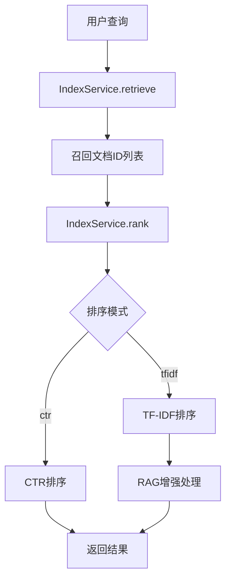

# 🤖 RAG功能使用指南

## 📖 概述

RAG（Retrieval-Augmented Generation，检索增强生成）功能已成功集成到搜索系统中。当用户选择TF-IDF排序模式时，系统会自动生成基于检索结果的智能回答。

## 🎯 功能特点

### ✅ 已实现功能

1. **条件启用** - 仅在TF-IDF模式下启用RAG功能
2. **智能回答** - 基于检索到的文档生成准确回答
3. **缓存机制** - 支持回答缓存，提高响应速度
4. **错误处理** - 完善的异常处理和降级机制
5. **配置灵活** - 支持多种配置参数调整

### 🔧 技术架构



## 🚀 使用方法

### 1. 启动系统

```bash
python start_system.py
```

### 2. 使用RAG功能

1. **进入搜索标签页** - 点击"🔍 第二部分：在线召回排序"
2. **选择排序模式** - 在"排序算法"下拉菜单中选择"tfidf"
3. **输入查询** - 在"实验查询"框中输入问题
4. **执行搜索** - 点击"🔬 执行检索"按钮
5. **查看RAG回答** - 在"🤖 RAG智能回答"区域查看生成的回答

### 3. 示例查询

推荐测试查询：
- "什么是人工智能？"
- "机器学习的基本原理"
- "深度学习的特点"
- "自然语言处理"

## ⚙️ 配置参数

### RAGConfig 配置类

```python
@dataclass
class RAGConfig:
    enabled: bool = True                    # 是否启用RAG功能
    llm_provider: str = "mock"             # LLM提供商 (mock, openai, local)
    model_name: str = "gpt-3.5-turbo"      # 模型名称
    max_context_tokens: int = 3000         # 最大上下文token数
    top_k_docs: int = 3                    # 使用前K个文档
    temperature: float = 0.7               # 生成温度
    max_response_tokens: int = 500         # 最大回答token数
    cache_enabled: bool = True             # 是否启用缓存
    cache_ttl: int = 3600                  # 缓存过期时间(秒)
```

### 自定义配置示例

```python
from search_engine.rag_service import RAGConfig, RAGService

# 创建自定义配置
config = RAGConfig(
    enabled=True,
    llm_provider="mock",
    top_k_docs=5,
    max_context_tokens=2000,
    cache_enabled=True,
    cache_ttl=1800  # 30分钟缓存
)

# 创建RAG服务
rag_service = RAGService(config, index_service)
```

## 🔍 核心组件

### 1. RAGService 类

**主要方法**：
- `enhance_search_results()` - 基于搜索结果生成RAG回答
- `build_context()` - 构建上下文信息
- `generate_answer()` - 生成回答
- `get_stats()` - 获取服务统计信息

### 2. MockLLMClient 类

**功能**：
- 模拟LLM客户端，用于测试
- 支持常见查询的模板回答
- 无需外部API依赖

### 3. 缓存机制

**特点**：
- 基于查询和文档ID的MD5哈希缓存键
- 支持TTL过期时间
- 自动清理过期缓存

## 📊 性能优化

### 1. 上下文构建优化

```python
def build_context(self, search_results: List[Tuple], max_tokens: int = None) -> str:
    """构建上下文信息"""
    max_tokens = max_tokens or self.config.max_context_tokens
    context_parts = []
    current_tokens = 0
    
    for i, result in enumerate(search_results):
        if len(result) >= 3:
            doc_id, score, summary = result[0], result[1], result[2]
        else:
            continue
        
        # 获取完整文档内容
        if self.index_service:
            full_content = self.index_service.get_document(doc_id)
            if not full_content:
                full_content = summary  # 降级使用摘要
        else:
            full_content = summary
        
        # 计算token数量（简化估算：1个token约等于4个字符）
        estimated_tokens = len(full_content) // 4
        
        if current_tokens + estimated_tokens <= max_tokens:
            context_parts.append(f"文档{i+1} (ID: {doc_id}, 相关度: {score:.4f}):\n{full_content}\n")
            current_tokens += estimated_tokens
        else:
            # 如果超出token限制，截取部分内容
            remaining_tokens = max_tokens - current_tokens
            if remaining_tokens > 100:  # 至少保留100个token
                truncated_content = full_content[:remaining_tokens * 4] + "..."
                context_parts.append(f"文档{i+1} (ID: {doc_id}, 相关度: {score:.4f}):\n{truncated_content}\n")
            break
    
    return "\n".join(context_parts)
```

### 2. 缓存优化

```python
def _get_cache_key(self, query: str, search_results: List[Tuple]) -> str:
    """生成缓存键"""
    # 基于查询和文档ID生成缓存键
    doc_ids = [str(result[0]) for result in search_results if len(result) > 0]
    cache_content = f"{query}_{'_'.join(sorted(doc_ids))}"
    return hashlib.md5(cache_content.encode()).hexdigest()
```

## 🧪 测试验证

### 1. 功能测试

```bash
# 运行RAG功能测试
python test_rag_functionality.py

# 运行RAG集成测试
python test_rag_integration.py
```

### 2. 测试覆盖

- ✅ 模拟LLM客户端测试
- ✅ RAG服务基本功能测试
- ✅ 与索引服务集成测试
- ✅ 缓存功能测试
- ✅ 不同配置参数测试

## 🔧 扩展开发

### 1. 集成真实LLM

```python
# 在RAGService._init_llm_client()中添加
elif self.config.llm_provider == "openai":
    import openai
    openai.api_key = os.getenv("OPENAI_API_KEY")
    return openai
```

### 2. 添加新的LLM提供商

```python
elif self.config.llm_provider == "local":
    # 集成本地LLM模型
    from local_llm import LocalLLMClient
    return LocalLLMClient(self.config.model_name)
```

### 3. 优化提示词

```python
def generate_answer(self, query: str, context: str) -> str:
    """生成回答"""
    prompt = f"""
基于以下检索到的文档内容，回答用户的问题。

用户问题: {query}

检索到的相关文档:
{context}

请基于上述文档内容，生成一个准确、全面的回答。要求：
1. 回答要准确，基于文档内容
2. 如果文档中没有相关信息，请明确说明
3. 回答要简洁明了，突出重点
4. 可以引用具体的文档信息

回答:
"""
    # 调用LLM生成回答
    response = self.llm_client.generate(prompt, self.config.temperature)
    return response.strip()
```

## 📈 监控和统计

### 1. 服务统计

```python
stats = rag_service.get_stats()
print(f"RAG服务统计: {stats}")
```

**统计信息包括**：
- 功能启用状态
- LLM提供商信息
- 缓存状态和大小
- 配置参数

### 2. 性能监控

```python
# 监控RAG处理时间
import time

start_time = time.time()
rag_answer = rag_service.enhance_search_results(query, search_results)
processing_time = time.time() - start_time

print(f"RAG处理时间: {processing_time:.2f}秒")
```

## 🚨 故障排除

### 1. 常见问题

**问题1**: RAG功能不显示
- **解决方案**: 确保选择了"tfidf"排序模式

**问题2**: 回答质量不佳
- **解决方案**: 调整`top_k_docs`和`max_context_tokens`参数

**问题3**: 响应速度慢
- **解决方案**: 启用缓存，减少`top_k_docs`数量

### 2. 错误处理

```python
try:
    rag_answer = rag_service.enhance_search_results(query, search_results)
except Exception as e:
    print(f"RAG处理失败: {e}")
    rag_answer = f"RAG功能暂时不可用: {str(e)}"
```

## 🎯 最佳实践

### 1. 配置建议

- **生产环境**: 使用真实的LLM提供商
- **开发测试**: 使用MockLLMClient
- **缓存设置**: 根据查询频率调整TTL
- **文档数量**: 根据文档长度调整top_k_docs

### 2. 性能优化

- 合理设置上下文token限制
- 启用缓存机制
- 优化文档检索质量
- 监控处理时间

### 3. 用户体验

- 提供清晰的错误提示
- 支持降级机制
- 优化回答格式
- 保持界面一致性

## 📚 相关文档

- [项目架构文档](./ARCHITECTURE_AND_MODULES.md)
- [API文档](./API.md)
- [快速开始指南](./QUICK_START.md)
- [安装说明](./INSTALLATION.md)

---

**版本**: 1.0.0  
**更新日期**: 2024-01-15  
**维护者**: 开发团队 